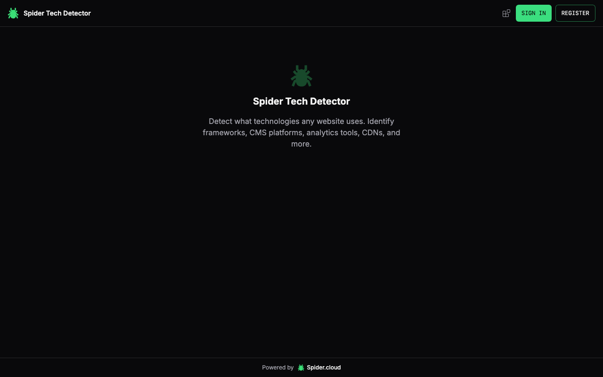

# Spider Tech Detector

Detect what technologies any website uses -- frameworks, CMS, analytics, CDNs, and more -- using [Spider Cloud](https://spider.cloud), the fastest web crawling infrastructure.

[](https://vercel.com/new/clone?repository-url=https%3A%2F%2Fgithub.com%2Fspider-rs%2Fspider-tech-detector&env=NEXT_PUBLIC_SUPABASE_URL,NEXT_PUBLIC_SUPABASE_ANON_KEY)

**Live Demo:** [https://tech-detector.spider.cloud](https://tech-detector.spider.cloud)



## Features

- Detect 50+ technology signatures across any website
- 14 detection categories: Framework, Library, CMS, Analytics, CDN, Hosting, UI, Payment, Support, Security, Monitoring, Feature Flags, A/B Testing, Marketing
- Confidence scores for each detected technology
- Sortable and filterable results table
- Real-time JSONL streaming results via Spider Cloud API
- Export reports as JSON, CSV, or Markdown
- Supabase authentication (GitHub & Discord)
- Cross-app switcher to jump between all [Spider Cloud](https://spider.cloud) tools with the current URL pre-filled

## Getting Started

### Prerequisites

- Node.js 18+
- A [Spider Cloud](https://spider.cloud) account with API credits
- Supabase project for authentication

### Setup

1. Clone the repository:

```bash
git clone https://github.com/spider-rs/spider-tech-detector.git
cd spider-tech-detector
```

2. Install dependencies:

```bash
npm install
```

3. Configure environment variables:

```bash
cp .env.local .env
```

Edit `.env` and add your Supabase and Spider Cloud credentials:

```
NEXT_PUBLIC_SUPABASE_URL=your_supabase_url
NEXT_PUBLIC_SUPABASE_ANON_KEY=your_supabase_anon_key
NEXT_PUBLIC_API_URL=https://api.spider.cloud
```

4. Run the development server:

```bash
npm run dev
```

Open [http://localhost:3001](http://localhost:3001) in your browser.

## Tech Stack

- [Next.js 14](https://nextjs.org/) -- React framework
- [Tailwind CSS](https://tailwindcss.com/) -- Styling
- [shadcn/ui](https://ui.shadcn.com/) -- UI components
- [Supabase](https://supabase.com/) -- Authentication
- [Spider Cloud](https://spider.cloud) -- Web crawling API

## Related Spider Cloud Tools

| Tool | URL |
|------|-----|
| Dead Link Checker | [dead-link-checker.spider.cloud](https://dead-link-checker.spider.cloud) |
| A11y Checker | [a11y-checker.spider.cloud](https://a11y-checker.spider.cloud) |
| Security Scanner | [security-scanner.spider.cloud](https://security-scanner.spider.cloud) |
| Schema Validator | [schema-validator.spider.cloud](https://schema-validator.spider.cloud) |
| Knowledge Base | [knowledge-base.spider.cloud](https://knowledge-base.spider.cloud) |
| Perf Runner | [perf-runner.spider.cloud](https://perf-runner.spider.cloud) |
| Content Translator | [content-translator.spider.cloud](https://content-translator.spider.cloud) |
| Diff Monitor | [diff-monitor.spider.cloud](https://diff-monitor.spider.cloud) |
| Sitemap Generator | [sitemap-generator.spider.cloud](https://sitemap-generator.spider.cloud) |
| Link Graph | [link-graph.spider.cloud](https://link-graph.spider.cloud) |

## License

[MIT](LICENSE)
